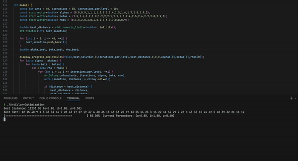

# Exercise 7 - Solutions Kai Schultz
The code should have implemented the ACO algorithm correctly. If you run ant-colony.py it will start running all the different combinations of alpha, beta and rho. 
It logs the initial pheromone of the current colony. Other than that it will update you in the terminal if there is a new best path.

I am running multiple runs per configuration, because due to computational limitations I cannot run larger colonies / longer iterations. So I am subject to larger deviations. 
To counteract this I am running the same configuration multiple times.

I have put significantly more effort into the C version, so for a better experience I recommend trying out that version. It is pretty simple to set up you only need cmake.

## HOW TO RUN
### Compile and build yourself
```bash
cd /C_version # make sure you are in the C_version folder
mkdir build # create build folder for C
cd /build # switch into build folder
cmake .. # Compile and build the necessary code
cmake --build . --config Release # creates the executable
./AntColonyOptimization # execute the program
```
### Run the binary
```bash
cd /release # make sure you are in the release folder
./AntColonyOptimization_Arm64 # executes the program for Mac
./AntColonyOptimization_Win64.exe # executes the program for windows
```

* Make sure to paste the att48.tsp file into the same folder as the .exe, since it expects the problem file to be in the same folder otherwise it wont find it.
* If you have an incompatible operating systems for the binaries you have to compile the program yourself.
* Make sur your terminal is wide enough since! The program reprints 3 lines so if it displays more than 3 lines it will mess up the reprint!

## Optimizations - C++
Because it was still slow i decided to rewrite the source code in c++. To try out the c++ version either just start the executable in the release package or compile like this:

### Task 1.1
The initialize_pheromone_map() for initializing pheromone trails based on the ACO algorithm was implemented 
[here](C_version/environment.cpp#L66). It initializes the pheromone of each edge to be ant_population / total_cost. Where the total_cost is the result of a nearest_neighbour heuristic with a random starting node.

### Task 1.2
The update_pheromone_map() is implemented [here](C_version/environment.cpp#L125). It first goes through all edges and evaporates the existing pheromones according to the evaporation rate rho. Then it goes through all the ants and for each ant it goes through all paths that this ant took. Each path gets deposited the specified amount -> 1 / distance_travelled_by_ant.

### Task 2.1
The function get_distance() is implemented [here](C_version/environment.cpp#L104). It is implemented in the environment and not the ant itself, the ant can just call this function through its environment. It made more sense in the environment class because it was used to build the distances. It implements the pseudo euclidian distance as specified in the paper. 

The select_path() is implemented [here](C_version/Ant.cpp#L76). It receives a vector of nodes that have not been visited yet, as well as the precomputed probability matrix for all edges. It reserves space for another vector that will hold the probabilities for all the not yet visited nodes. It then iterates through all not yet visited nodes, summing it up and setting the probabilities for each. Then it iterates over the probabilities again dividing by the sum of all probabilities. It then picks a random neighbour according to the probabilities we calculated above. 

### Task 2.2
The run() is implemented [here](C_version/Ant.cpp#L35). The run first clears all relevant variables. Then it creates the vector containing all not yet visited nodes (which at this point are all the nodes except the initial one). Next it precomputes the probability matrix for this run. Then it will loop until all nodes have been visited. After that it will connect back to the starting node and finish the run.

### Task 2.3 
the solve() is implemented [here](C_version/Ant-colony.cpp#L93). It iterates through all iterations. For each iteration it goes through all ants and calls the run() function. If any ant has explored a new shortest path the variables are updated. Once all ants have finished their run, the environment updates the pheromone map.

## Optimizations - Python
Due to the nature of the problem, the computer has to do a lot of computations on vectors. So I implemented most of the vital parts with numpy to utilize vectorized operations.
Additionally I precomputed some aspects as the space / time tradeoff was worth it. I significantly reduced the computation time this way.

### Ant
In the ant i realized that I can precompute the entire probability matrix for each run. Since the distances are static either way, we can easily just have the distance heuristic precomputed.
Additionally, the pheromones only change after an iteration, so for each run() cycle it stays the same. That means we can use numpy to directly compute the probability for each edge at once.
This is done in the precompute_probability_matrix() method. Because we need each probability either way it is also not a waste to do it this way. 

Also since we now have the probabilities in a numpy array we can collect the next node through vectorized numpy operations as well, this is done in the select_path() method.

### Environment
In the environment I unpack the tsplib95 problem and create two numpy arrays. One array for the distances and one array for the pheromone levels. With these two numpy arrays we can do all computations
efficiently. The initialization is not that import for the overall performance. Overall for performance the ant is much more vital since most of the computation happens there. Nevertheless the update_pheromone_map()
function gets called frequently as well. Here we can utilize vectorized computation for the evaporation. 

## Task 3
I tested the different variations empirically.
```cpp
    std::mt19937 generator(1);
    ants = 48, iterations = 50, iterations_per_level = 10;
    alphas = {0.8,0.9,1,1.1,1.2,1.3,1.4,1.5,1.6,1.7,1.8,1.9,2};
    betas = {1.5,1.6,1.7,1.8,1.9,2,2.1,2.2,2.3,2.4,2.5,2.6,2.7,2.8,2.9,3};
    rhos = {0.1,0.2,0.3,0.4,0.5,0.6,0.7,0.8,0.9};
```
I initialized the seed to get reproducible results. Each Colony has 48 ants and will run for 50 iterations. This process is repeated 10 times for each combination of alpha, beta and rho. 
    
    ant.run() calls -> 48 * 13 * 16 * 9 * 10 * 50

Each time an ant runs it will call the select_path 48 times as well, this results in over 2 billion calls to select_path. Which is excatly why it was important to switch to c++ and to optimize the logic in the select_path function.




While i would have preferred longer iterations, my computer cannot handle more than this

### How do parameters alpha and beta impact the performance?
Alpha is used to calculate the weight that pheromones have when deciding on what path to take. If alpha is zero, pheromones are disregarded.
Beta does the same just for the distance. 
#### Alpha 
* Lower Alpha values mean less importance of pheromone trails. Which means less importance of existing paths and higher chances of exploring new trails.
* Higher Alpha values put more importance on pheromone trails. Which means higher probability for chosing paths already known. 

Ofcourse the challange here is to find the sweet spot, where we explore all relevant trails and do not get stuck on non-optimal paths, but once we have found an optimal path wil stay on it.
Through experimenting I have found that staying on the lower side of alpha values is a bit more reliant, since even though it might take longer to find a good path, the risk of getting stuck on a less than optimal path is much lower.

The shortest path that i found also had an alpha value of 1. Indicating, that this value helps to find a good balance of exploration and still staying on the best paths.

#### Beta
* Lower Beta values mean less importance of closer nodes. 
* Higher Beta values mean we go for the closest node more often.

While it at first seems reasonable to go to closer nodes because then the path is shorter, this can then lead to much longer paths once all the close edges are used up. This is why it is important to sometimes use a longer edge first, so that an overall shorter path can be created.

The shortest path that i found used a beta of 1.5 which is also lower than expected (since standard is 2 - 5). While this in my case seemed to be the value that gave the best result on how the distance between nodes should be valued, since my tests are not that large, it could be due to chance. 

### How does the evaporation rate rho affect the performance?
Rho is the parameter that decides how much pheromone evaporates between tours. So a higher Rho means the pheromones evaporate a lot and the results of the last tour have less influence over current decisions. A lower Rho means, that
paths explored in the last tour will still have a lot of pheromone deposited on them and therefore a higher probability to be chosen again. If Rho is one the ants are basically memory less, since all the pheromones instantly evaporate, if rho is one then it does not matter what alpha is.
* Lower Rho values mean higher base importance of pheromone
* Higher Rho values mean less base importance of pheromone

Since in the path selection the pheromone level of the path is taken to the power of alpha, a higher pheromone level will have similar effects as a higher alpha.

With my shortest path, It was found using a rho of 0.4. This is again just slightly under the standard of 0.5. Indicating, that it was helpful that the pheromone evaporated just a little bit slower.

### Shortest Path

The overall shortest path that i found was 10712 with the values: alpha = 1, beta = 1.5, rho = 0.4. 
This shows that the ants relied both on the pheromone and the distance between the nodes. Since the beta is just 0.5 larger, it means that the ants relied a little bit more on the distance between nodes than on the pheromone between them. But since the evaporation rate is lower than usual and the difference between alpha and beta is not that large, overall the ants seem to have found that both pheromones and the distance between nodes are rhoughly as important as eachother. 

I have also achieved a 10733 with: alpha = 1.1, beta = 6, and p = 0,4.


s
### Change of Strategy

I realized that just going through iterations and only collecting the best distance just puts me in the crosshair of chance. That is why I added also a display for the best average distance and the alpha, beta, and rho used to achieve it. Then i decreased the iterations that the ants ran but in increased the amount of times a combination is run. Now each Colony goes through 20 iterations but does so 50 times on the same settings. This way I can get a more robust reading of the effectiveness of the combinations. 
```cpp
    std::mt19937 generator(1);
    const int ants = 48, iterations = 20, iterations_per_level = 50;
    const std::vector<double> alphas = {0.8,0.9,1,1.1,1.2,1.3,1.4,1.5,1.6,1.7,1.8,1.9,2};
    const std::vector<double> betas = {1,1.2,1.5,1.7,2,2.5,3,3.5,4,4.5,5,5.5,6};
    const std::vector<double> rhos = {0.3,0.4,0.5,0.6,0.7,0.8};
```
These were my final settings.


#### How would you modify your implementation in orer to apply ACO to DTSP?
If cities were to be added and removed at run-time, I would have to restructure the code to allow nodes to be added and removed. Additionally whenever a new node gets added there will be n - 1 new edges and whenever a node removed there will be n -1 edges removed.
The adding of cities would have to happen after or before the ants are on tour. 
##### In case of Removal:   
    If a node gets removed we can simply remove all associated edges. The ants should then find a new optimal path.
##### In case of Addition:
    If we add a new node, we should instantialize all the new edges with a base pheromone level. if only an insignificant amount of nodes is added in comparison to the graph size, we can simply set it to the initial base pheromone level and leave it be.
    If we add a significant amount of new nodes, it might be helpful to reinitialize the entire graph. 


### improvements
If i had more time i would have liked to make the data more illustrative. Saving all results of all iterations, to show in a 3d graph the average paths for each combination. additionally this could be expanded to handle other tsps as well. It also would be beneficial to see if there are measures that can indicate that a certain combination has leveled out, and if that happens if we can skip some iterations to save compute.